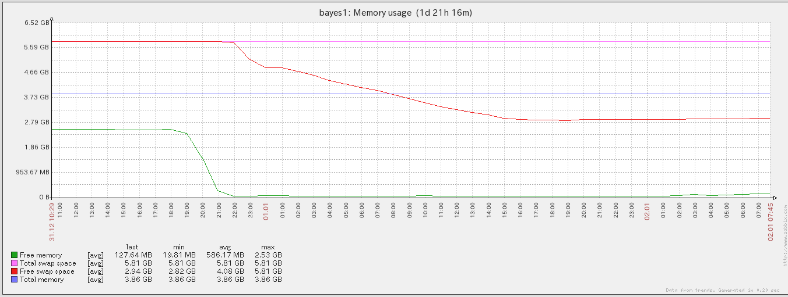

# Listening Bord プロジェクト定義
- 時系列データ・シリーズデータを保存し呼び出すAPIストレージサービス
- パブリックデータ格納サービス
	- パブリックデータのクローリングと格納
	- パブリックデータのAPIによる供給
	- パブリックデータのダッシュボードによる提示
- IoT社会の到来を目指した時系列データ・シリーズデータを格納するストレージ
	- IoT端末からのデータ格納
		- サーバーからのデータ格納
		- スマホからのデータ格納
		- センサーデバイスからのデータの格納
		- POS端末からのデータ格納
	- API経由によるデータの検索・取得
		- プログラムAPI
		- ダッシュボード
- 目指さないもの
	- tdagentやloglyなどのサーバーメトリックサービス
	- マイニング・解析等の機能は当初はやらない

# Listening Bord 要件
- メタデータの全文検索
- シリーズデータのTB以上の拡張
- 柔軟なAPI
